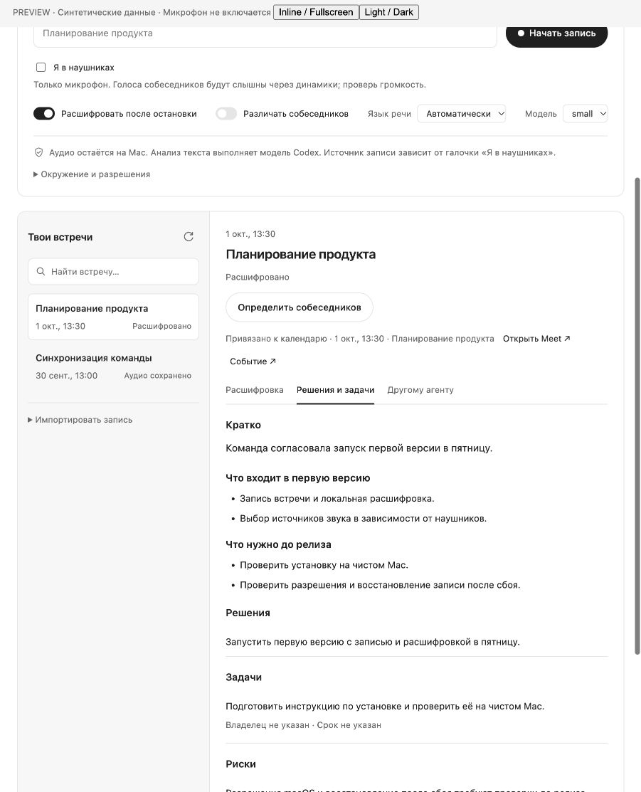

# Whisper Meetings для Codex

Локальный плагин: запись встреч из Zoom/Meet с выбором источников звука → Whisper → анализ встречи агентом → контекст для других проектов и агентов.

Версия **0.4.0 — предварительный релиз**. Аудио и Whisper работают локально; анализ текста выполняет настроенная модель Codex. Полная панель доступна в хостах, которые поддерживают MCP Apps. Поддержка формата сама по себе не означает одобрение общего каталога OpenAI.

## Установка из публичного каталога Git

Нужны macOS 15+, Command Line Tools/Xcode, [uv](https://docs.astral.sh/uv/) и Codex с поддержкой плагинов.

```sh
git clone --branch v0.4.0 https://github.com/legostin/whisper-meetings.git
cd whisper-meetings
python3 plugins/whisper-meetings/scripts/setup.py
codex plugin marketplace add legostin/whisper-meetings --ref v0.4.0
codex plugin add whisper-meetings@whisper-local
```

## Локальная установка для разработки

Нужны macOS 15+, Command Line Tools/Xcode, [uv](https://docs.astral.sh/uv/) и Codex с поддержкой плагинов.

```sh
python3 plugins/whisper-meetings/scripts/setup.py
codex plugin marketplace add "$PWD"
codex plugin add whisper-meetings@whisper-local
```

Setup устанавливает зафиксированные зависимости, собирает нативный рекордер и загружает модель `small` (примерно 460 МБ). Повторный запуск использует уже установленную модель. Другую модель можно установить с `--model base`, `tiny`, `medium`, `large-v3` или `turbo`. `--skip-model` собирает только окружение и рекордер. Первичная установка требует интернета; расшифровка использует только локальные файлы модели.

Плагин появляется в источнике **Whisper Local**. Откройте новый чат после установки; если клиент не обновил каталог — перезапустите Codex. CLI устанавливает пакет в свой кэш; после изменений повторите `codex plugin add whisper-meetings@whisper-local`.

## Интерфейс

Скажите «Открой панель встреч». Сервер отдаёт встроенный HTML через MCP Apps, без внешних скриптов, шрифтов или трекеров. В чате отображается компактная карточка записи; кнопка «Открыть встречи» запрашивает отдельную полную панель. Там есть история и поиск, переключатель расшифровки после остановки, таймкоды и каналы расшифровки, короткое резюме и тематические пункты отчёта, решения/задачи/риски без ссылок на реплики, а также handoff для выбранного чата.

Кнопка «Разобрать с Codex» отправляет явный запрос текущему агенту прочитать текст и сохранить анализ. Подготовка handoff создаёт Markdown/JSON локально. Кнопка передачи требует точное название существующего чата и поручает доставку инструментам хоста; результат доставки отображается в чате. Если хост не принимает сообщения из панели, интерфейс предлагает текст запроса для копирования. UI не обещает выполненную отправку до подтверждения хоста.

Сервер объявляет стандартные MCP Apps metadata и OpenAI sidebar/thread entrypoints. Конкретная версия Codex/ChatGPT может отличаться по поддержке локального MCP и UI; при отсутствии панели остаются отдельные команды в чате. Проверка UI в синтетическом MCP Apps-хосте описана в [VALIDATION.md](VALIDATION.md).

Оформление использует нейтральные цвета, системные шрифты, монохромные иконки и переменные темы MCP Apps-хоста. Светлая и тёмная темы проверены в тестовом хосте.



## Читаемые отчёты

Вступление — 1–2 предложения, затем тематические блоки с короткими списками. Решения, задачи, риски и открытые вопросы идут отдельно. Ссылки на запись, таймкоды и номера реплик в отчёте не отображаются; внутренние `evidence_segment_ids` остаются в JSON для проверки выводов. Старые длинные вступления отображаются по пунктам; обновить Markdown-экспорты без изменения аудио/JSON можно через `scripts/refresh_reports.py` с Python установленного runtime.

## Русский язык, собеседники и наложение голосов

Whisper `small` распознаёт русский. По умолчанию язык определяется автоматически; в полной панели можно выбрать «Русский» или передать `language="ru"` в инструменте. Это язык речи, отдельный от RU/EN интерфейса.

Опциональная локальная диаризация устанавливается одной командой:

```sh
python3 plugins/whisper-meetings/scripts/setup.py --diarization
```

Нужны Apple Silicon, macOS 15+ и Swift 6.2+ (актуальные Xcode/Command Line Tools). Установщик скачивает публичные Core ML-модели Fluid Inference и зафиксированный SDK, проверяет контрольные суммы и собирает дополнительный helper. **Аккаунт Hugging Face, токен и API-ключ не требуются.** Первичная установка требует интернета; обработка аудио использует локальные модели. Выключенная диаризация не требует дополнительной установки.

Включите «Различать собеседников» перед новой записью/импортом или нажмите «Определить собеседников» для готовой встречи. Появятся метки голосов и кнопки назначения имён. Диаризация выполняется после расшифровки; потоковых меток во время звонка пока нет. Ошибка дополнительной обработки сохраняет готовый текст Whisper.

Метки действуют только внутри встречи и отдельно для каждого канала. Они не подтверждают личность человека; голосовые векторы не сохраняются и не сопоставляются между встречами. Одновременные голоса в одном потоке отмечаются как наложение; слова не приписываются одному собеседнику. Переключение говорящих внутри одной длинной реплики тоже отмечается как неоднозначность. Одновременная речь в микрофоне и звуке Mac может оказаться эхом; каналы не доказывают, что это два разных человека.

Диаризация сохраняет текст Whisper: она не восстанавливает потерянные при наложении слова и не создаёт отдельные аудиодорожки каждого удалённого участника. Переименование или повторная обработка делает прежний анализ устаревшим; выполните разбор заново. Метки, имена и предупреждения следуют в локальные экспорты и handoff.

Модели: [публичные Core ML-конверсии Community-1](https://huggingface.co/FluidInference/speaker-diarization-coreml), выбранные артефакты CC-BY-4.0; SDK: [FluidAudio](https://github.com/FluidInference/FluidAudio). Лицензии, атрибуция и происхождение сохраняются рядом с установленными моделями. Мы используем обычную временную разметку с наложениями, а не режим exclusive, удаляющий пересечения.

## Привязка к Google Calendar / Meet

Опциональный сценарий через **подключённую интеграцию календаря хоста**: нажмите «Выбрать из Google Calendar», выберите событие в разговоре с агентом, затем выберите его в панели. Событие задаёт название новой записи и сохраняется вместе с ней: calendar ID, event ID, начало/конец и ссылки Calendar/Meet. Выбранное событие можно привязать и к уже существующей записи. Привязка следует за встречей в расшифровку и пакет контекста.

Наш локальный сервер не подключается к Google API, не хранит Google OAuth-токены и не меняет календарь. Календарный connector подключается штатными средствами Codex/ChatGPT; его наличие и доступ зависят от аккаунта и хоста. Если connector недоступен, можно передать метаданные выбранного события напрямую в `meetings_link_calendar_event`; остальные функции работают независимо от календаря. Участники и описание события не копируются. Привязка не запускает запись, не подключает бота в Meet и не означает использование Meet-native recording.

## Команды в чате

- «Открой панель встреч» — карточка записи и полный workspace, если поддерживает хост.
- «Привяжи эту запись к событию календаря …» — локальная привязка события/Meet.
- «Начни запись встречи “Планирование”» — только микрофон по умолчанию; «я в наушниках» включает также звук Mac.
- «Выключи расшифровку этой встречи» — запись продолжается, Whisper после остановки не запускается.
- «Включи расшифровку» — включить обработку после остановки.
- «Останови запись и расшифруй» — остановить, обработать в фоне.
- «Останови без расшифровки» — сохранить только аудио.
- «Расшифруй файл `/absolute/path/meeting.m4a`» — импортировать существующую запись.
- «Разбери последнюю встречу: решения, задачи, риски» — агент читает все страницы текста и сохраняет анализ с источниками.
- «Подготовь контекст этой встречи для инженерного агента» — локальные Markdown/JSON-пакеты.
- «Передай пакет в чат …» — передача выполняется инструментами Codex, если пользователь указал чат и авторизовал сообщение.

## Что сохраняется

По умолчанию данные находятся в `~/.local/share/whisper-meetings/`; переменная `WHISPER_MEETINGS_HOME` меняет каталог.

```text
runtime/                 Python-окружение и нативный рекордер
models/small/            Локальная модель Whisper и информация о её ревизии
models/speaker-diarization-coreml/  Опциональные модели собеседников
meetings.sqlite3         Состояния заданий
meetings/<id>/
  microphone.wav         Микрофон
  system.wav             Звук Mac
  meeting.json           Метаданные
  transcript.json        Сегменты с таймкодами, каналами и ID источников
  diarization.json       Опциональные интервалы голосов и наложения
  transcript.md/.txt/.srt
  analysis.json/.md       Анализ, выполненный агентом
  handoffs/              Пакеты для других областей
```

Архив хранится отдельно от кэша плагина и остаётся после переустановки. На новые файлы ставятся права доступа только для текущего пользователя. Автоматического удаления нет.

## Запись и ограничения

Для двух дорожек рекордер использует ScreenCaptureKit; для одного микрофона — AVAudioEngine. Он не сохраняет видео или скриншоты. При первом запуске macOS может запросить доступ к микрофону и Screen & System Audio Recording. `meetings_doctor` проверяет разрешения без запроса и без записи. Название в системных настройках может относиться к рекордеру или запускающему приложению.

Галочка **«Я в наушниках»** по умолчанию снята: записывается только микрофон через AVAudioEngine, без захвата звука Mac и запроса Screen Recording. Голоса собеседников в этом режиме должны быть слышны через динамики; тихий или выключенный звук может не попасть в запись. С галочкой рекордер записывает микрофон и **весь звук Mac**, включая уведомления и другие приложения. Выбор фиксируется до старта и не меняется во время записи. Каналы сохраняются отдельно и выравниваются по общим таймкодам. Метки `microphone` / `system` обозначают каналы. Опциональная диаризация оценивает отдельных говорящих внутри каждого канала. Перекрывающаяся речь и ошибки Whisper требуют проверки по аудио.

Запись выполняется отдельным процессом и переживает переподключение MCP. **Отключение плагина само по себе не останавливает запись** — сначала скажите «останови запись». Защитный предел — 12 часов; при потере процесса управляющего задания нативный рекордер также заканчивает запись. Плагин никогда не начинает запись автоматически.

Whisper работает локально через faster-whisper, CPU/int8. Анализ выполняет настроенная модель текущего агента Codex: прочитанный текст входит в его контекст. Плагин не загружает аудио в облако. Подготовка handoff создаёт файлы; отправка сообщения другому чату — отдельное действие средствами Codex.

При сбое аудио сохраняется, статус содержит ошибку, обработку можно повторить. Одна запись может быть активна одновременно. Расшифровка начинается после остановки; потокового текста во время встречи в этой версии нет.

## Разработка и проверка

```sh
cd plugins/whisper-meetings
export UV_PROJECT_ENVIRONMENT="$HOME/.cache/whisper-meetings-dev-venv"
uv sync --frozen
uv run pytest
python3 scripts/build_ui.py
uv run python ../../scripts/validate.py
```

Проверка регистрации в Codex без создания чата: `python3 plugins/whisper-meetings/scripts/host-check.py` из корня репозитория. Для сквозного теста используйте `scripts/smoke.py <локальный_синтетический_аудиофайл>` с Python из установленного runtime. Этот тест проверяет MCP Apps resource и аннотации, импортирует файл, проверяет переподключение MCP, расшифровку, сохранение анализа, привязку события и handoff; микрофон не включается.

Схема анализа — `analysis.schema.json`. MCP-сервер — `server.py`; управление заданиями — `meetings.py`; нативный рекордер — `native/Capture.swift`. `scripts/run-server.sh` запускает сервер из стабильного локального окружения и не устанавливает зависимости автоматически.

Для проверки русского и диаризации добавьте `--language auto --diarize` к `scripts/smoke.py`, передав синтетическую русскую запись. `scripts/smoke_overlap.py` проверяет установленный нативный движок на двух встроенных голосах macOS и их искусственном наложении; микрофон не включается, временные аудиофайлы удаляются. Запускайте оба скрипта Python из установленного runtime. Результаты и границы проверки: [VALIDATION.md](VALIDATION.md).

Формат пакета и локального каталога: [официальная документация плагинов](https://developers.openai.com/plugins/build/plugins). Захват двух аудиоисточников: [ScreenCaptureKit, Apple](https://developer.apple.com/videos/play/wwdc2024/10088/).


Синтетическая UI-проверка: `python3 scripts/preview.py` из корня, затем открыть `http://127.0.0.1:8768`. Demo-хост явно помечен и не включает микрофон. ZIP собирается командой `python3 scripts/package.py`; модели, runtime, записи и учётные данные в пакет не входят.

## Публикация и стандарты

Пакет использует переносимый Agent Plugins 1.0.0, MCP stdio, MCP Apps SDK и официальные OpenAI UI entrypoints. Подробное соответствие и нерешённые требования общего каталога: [docs/OPENAI_STANDARDS.md](docs/OPENAI_STANDARDS.md). Публичный Git-каталог — самостоятельный способ распространения; одобрение Universal Plugin Directory не заявлено.

[Privacy policy](plugins/whisper-meetings/PRIVACY.md) · [Usage terms](plugins/whisper-meetings/TERMS.md) · [Support](https://github.com/legostin/whisper-meetings/issues) · [Changelog](CHANGELOG.md)
